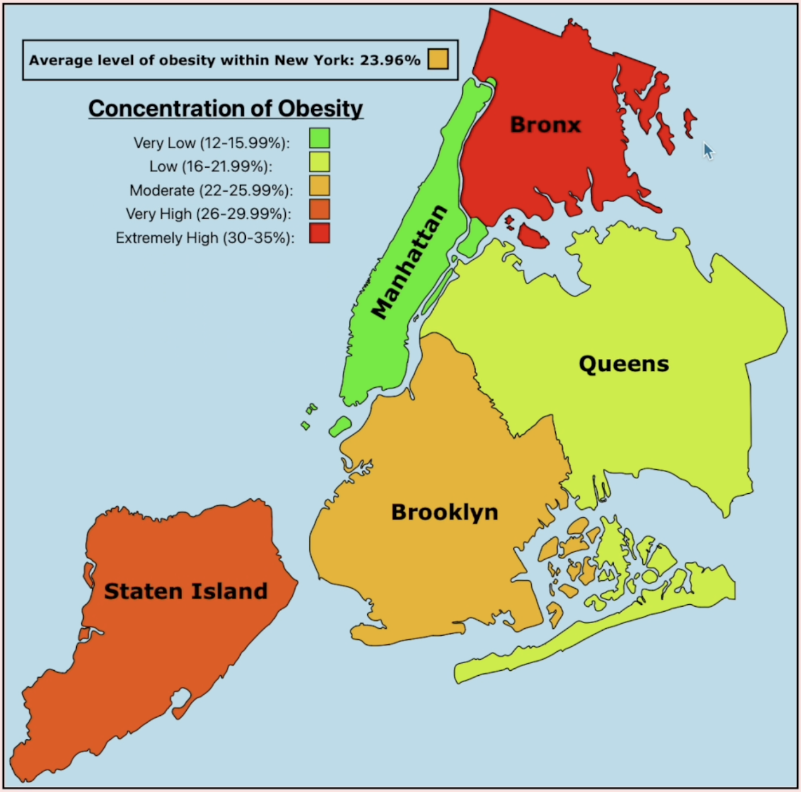
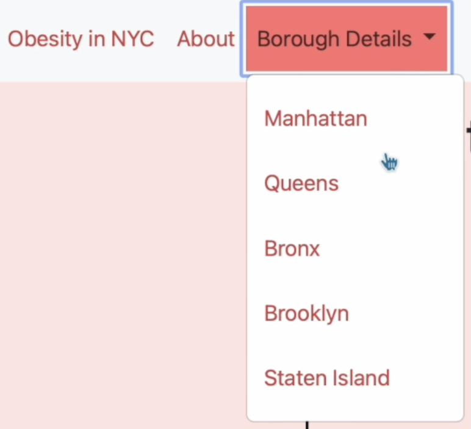
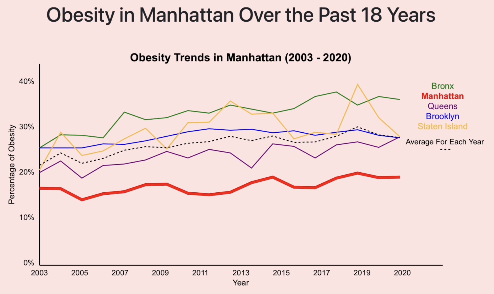
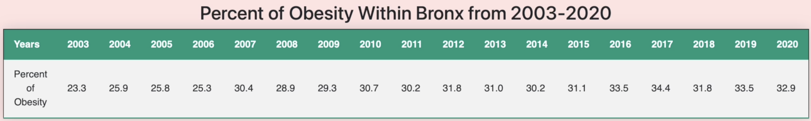

# Obesity Trends in New York City (2003–2020)

## Overview
A **full-stack, data-driven web application** that transforms **raw NYC Department of Health datasets** into **interactive, insight-rich visualizations**.  
This project showcases:
- **Data engineering**: cleaning, restructuring, and storing multi-format datasets.  
- **Automated analytics**: generating statistical summaries directly from code.  
- **Polished UI/UX**: delivering professional, responsive visuals for decision-making.  

Recruiters: this project demonstrates **end-to-end ownership** — from raw data ingestion → backend processing → frontend visualization — a complete data product.

---

## Technical Highlights
- **Data Engineering**
  - Built a **custom Python pipeline** to parse, clean, and restructure 18 years of obesity data from CSV → structured JSON (`broad.json`, `specific.json`).
  - Type-safe conversions, key normalization, and borough/year hierarchical indexing.
- **Automated Insight Generation**
  - Python scripts dynamically generate borough-specific summaries based on calculated statistical trends.
- **Full-Stack Delivery**
  - **Backend**: Flask server serving dynamic HTML templates with injected JSON.
  - **Frontend**: HTML5, custom CSS, and SVG graphics for scalable, accurate visuals.
- **Advanced Data Visualization**
  - Macro NYC map with boroughs color-coded by average obesity rate.
  - Borough-specific trend charts with cross-borough comparisons.
  - Styled data tables for precise, year-by-year obesity rates.

---

## Website Interface & Visuals

<p align="center">
  
  
</p>
<p align="center">
  <em>Macro NYC Map — geographic disparities at a glance</em>  
  &nbsp;&nbsp;&nbsp;&nbsp;
  <em>Navigation Header — quick access to macro and borough pages</em>
</p>

---

<p align="center">
  
</p>
<p align="center">
  <em>Borough Trend Graph — selected borough highlighted against all others</em>
</p>

---

<p align="center">
  
</p>
<p align="center">
  <em>Borough Data Table — exact yearly percentages with responsive styling</em>
</p>

---

## 📂 Project Structure
```plaintext
├── data/
│   ├── Borough.csv              # Obesity data aggregated by borough
│   ├── NYC.csv                  # NYC-wide obesity dataset
│   ├── broad.json               # All-borough dataset
│   ├── specific.json            # Borough-specific dataset
│
├── scripts/
│   ├── Borough.py               # Borough-level data processing logic
│   ├── NYC.py                   # NYC-wide analysis
│   ├── server.py                # Flask server
│
├── static/
│   ├── styles.css               # Styling
│   ├── NYC.svg                  # NYC borough map (vector)
│   ├── line.svg                 # Line chart assets
│   ├── nyc_map.png              # Macro map render
│   ├── manhattan_graph.png      # Example borough trend chart
│   ├── bronx_table.png          # Example borough data table
│   ├── header_screenshot.png    # Navigation header screenshot
│
├── templates/
│   ├── index.html               # Macro NYC page
│   ├── about.html               # About page
│   ├── manhattan.html           # Manhattan data page
│   ├── queens.html              # Queens data page
│   ├── bronx.html               # Bronx data page
│   ├── brooklyn.html            # Brooklyn data page
│   ├── si.html                  # Staten Island data page
│
└── README.md                    # Documentation
```

---

## Data Source
- **NYC Department of Health** — [Community Health Survey Data](https://a816-dohbesp.nyc.gov/IndicatorPublic/data-explorer/overweight/?id=2063#display=summary)

---

## Running the Project
```bash
# Clone the repo
git clone https://github.com/yourusername/nyc-obesity-visualization.git
cd nyc-obesity-visualization

# Install dependencies
pip install -r requirements.txt

# Run the Flask server
python scripts/server.py

# Visit in browser
http://127.0.0.1:5000/
